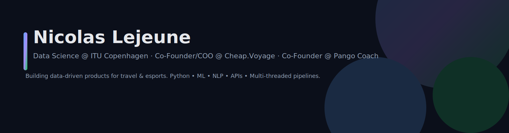

  

<h1 align="center">Hi, I'm Nicolas Lejeune 👋</h1>

  Data Science @ ITU Copenhagen · Co-Founder/COO at <a href="https://cheap.voyage">Cheap.Voyage</a> · Co-Founder at <a href="https://pango-coach.app/">Pango Coach</a>
   
  <strong>Building data-driven products that solve real problems.</strong>
   
  <a href="https://nicolaslejeune.dev">nicolaslejeune.dev →</a>

---

## Featured Projects

### Cheap.Voyage — Travel-Tech Startup
Making travel affordable and transparent for international students. Built multi-threaded fare search pipelines, affiliate integrations (SERP, AllAboard), and CO₂ tracking; also led research, KPIs, and user testing.  
**Tech:** Python · APIs · Multi-threading  
**Links:** [Website](https://cheap.voyage) · [LinkedIn](https://www.linkedin.com/in/nicolas-lejeune-261015285/)

### Pango Coach — AI Valorant Strategy Coach
AI coach that generates team comps and map-specific tactics; VOD analysis coming soon.  
**Tech:** AI/ML · NLP · Web App  
**Link:** [pango-coach.app](https://pango-coach.app/)

### Network Analysis Project
Advanced network analysis using Python/Jupyter: graph metrics, visualization, and analysis pipelines.  
**Tech:** Python · NetworkX · Data Visualization · Jupyter  
**Repo:** <https://github.com/niclejeune/network-analysis-project>

### Skin Cancer Detection (ML)
End-to-end pipeline for lesion classification on PAD-UFES-20: preprocessing, feature engineering, RandomForest baseline, evaluation.  
**Tech:** Python · ML · Computer Vision · Medical AI  
**Repo:** <https://github.com/niclejeune/projects-in-data-science>

### Applied Statistics Compendium
LaTeX + R notes and examples for “Intro to Statistical Data Analysis for the Life Sciences” (ITU).  
**Tech:** LaTeX · R · Statistics · Data Analysis  
**Repo:** <https://github.com/pe-ia/applied-statistics-2024>

### Algorithms & Data Structures Compendium
Comprehensive notes based on Sedgewick & Wayne; includes Python/Jupyter implementations.  
**Tech:** LaTeX · Algorithms · Data Structures · Python  
**Repo:** <https://github.com/niclejeune/Algorithms-and-Data-Structures-2024>

### Portfolio Website
Modern, responsive site (pure HTML/CSS/JS), with typing animation, project sections, experience timeline, and dark theme.  
**Tech:** HTML5 · CSS3 · JavaScript · Responsive Design  
**Repo:** <https://github.com/niclejeune/nicolas-lejeune-site>

---
<!-- Skills (text + logos via shields.io) -->

  <!-- Core -->
  
  
  

   

  <!-- Data / ML stack -->
  
  
  
  
  
  

---

## Experience

**Co-Founder & Developer — Pango Coach**  
*Aug 2025 – Present*  
Building an AI-powered Valorant strategy coach (team comps, map tactics, VOD analysis).

**Co-Founder & COO — Cheap.Voyage**  
*Aug 2024 – Present*  
Leading strategy/ops; business model design, partnerships, KPI development, API integrations, LLM development, and scaling.

**Student Assistant — Wineandbarrels A/S**  
*2023 – 2024*  
SEO + data workflows; analysis, content optimization, and analytics implementation.

**Instructor — TechLabs**  
*2022 – 2023*  
Taught coding and robotics (Python, robotics fundamentals, problem-solving).

---

## Contact

- Email: **me@nicolaslejeune.dev**  
- Phone: **+45 71 86 15 58**  
- Website: **[nicolaslejeune.dev](https://nicolaslejeune.dev)**  
- LinkedIn: <https://www.linkedin.com/in/nicolas-lejeune-261015285/>  
- GitHub: <https://github.com/niclejeune>  
- Cheap.Voyage: <https://cheap.voyage>

---

> 👀 PS: If you like this profile, check out my website: **[nicolaslejeune.dev](https://nicolaslejeune.dev)**.
